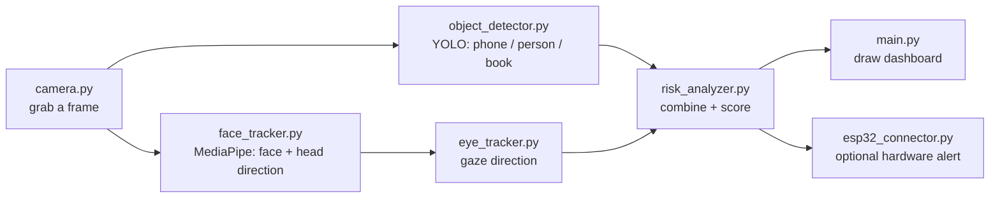

# 🎓 AI Exam Monitoring System

A real-time, webcam-based exam-proctoring tool built with **OpenCV**, **YOLO**, and **MediaPipe** — with optional **ESP32 hardware alerts** (LEDs, buzzer, and an LCD).

It watches for mobile phones, extra people, suspicious objects (books/laptops), a student looking away, or a missing face — then turns all of that into a single live **cheating-risk score** shown on screen (and optionally on a physical alert panel).

Written to be **beginner-friendly**: plain classes, simple dictionaries, and a comment above almost every important line explaining *why*, not just *what*.

---

## 📋 Table of Contents

- [Features](#-features)
- [How It Works](#-how-it-works)
- [Project Structure](#-project-structure)
- [Getting Started](#-getting-started)
- [Understanding the Risk Score](#-understanding-the-risk-score)
- [Configuration](#-configuration)
- [ESP32 Hardware Setup (Optional)](#-esp32-hardware-setup-optional)
- [Notes & Limitations](#-notes--limitations)
- [Contributing](#-contributing)
- [License](#-license)

---

## ✨ Features

- 🎥 Real-time webcam monitoring via OpenCV
- 📱 Mobile phone detection (YOLO object detection)
- 👥 Multiple-person detection
- 📚 Suspicious object detection (books, laptops)
- 🙂 Face presence + head-direction tracking (MediaPipe)
- 👀 Eye gaze tracking with a "looking away" timer
- 📊 Smoothed 0–100% cheating-risk score with SAFE / WARNING / CHEATING ALERT states
- ⏱️ False-alarm protection — nothing triggers off a single frame
- 🔌 Optional ESP32 hardware alerts: LEDs, buzzer, and an LCD, over **USB serial or WiFi**

---

## 🧠 How It Works

Every webcam frame flows through the same pipeline:



1. **`camera.py`** grabs one frame from the webcam, 20–30 times per second.
2. **`object_detector.py`** runs the frame through YOLO (a pre-trained AI model) and keeps only what matters: people, phones, books, laptops.
3. **`face_tracker.py`** uses MediaPipe to check whether a face is present, how many faces there are, and which way the head is turned.
4. **`eye_tracker.py`** looks at the iris position relative to the eye corners to guess whether the student is looking left, right, or straight ahead.
5. **`risk_analyzer.py`** is the decision-maker. It never trusts a single frame — a violation must repeat for several frames in a row (or persist for a few real seconds) before it counts. This avoids false alarms from things like one blurry frame or a quick head scratch.
6. **`main.py`** ties it all together in a loop, draws the live dashboard, and (optionally) forwards the status to the ESP32.

---

## 📁 Project Structure

```
exam_monitoring_system/
├── main.py                # Run this file. Connects everything together.
├── camera.py               # Opens your webcam and grabs frames.
├── object_detector.py      # Uses YOLO to spot phones / people / books.
├── face_tracker.py         # Uses MediaPipe to find faces + head direction.
├── eye_tracker.py           # Figures out which way the eyes are looking.
├── risk_analyzer.py        # Turns all the detections into a risk score.
├── esp32_connector.py      # Optional: sends status to ESP32 (serial or WiFi).
├── config.py                # All the settings you might want to tweak.
├── requirements.txt
└── esp32_firmware/
    └── exam_monitor_esp32.ino   # Arduino sketch for the optional hardware panel.
```

---

## 🚀 Getting Started

### Prerequisites
- Python 3.9+
- A webcam
- (Optional) An ESP32 board for physical alerts

### Installation

```bash
git clone <this-repo-url>
cd exam_monitoring_system
pip install -r requirements.txt
```

### Run it

```bash
python main.py
```

- A window opens showing your webcam with a live status panel in the top-left corner.
- Press **`q`** to quit.
- On first run, YOLO automatically downloads a small model file (`yolov8n.pt`, ~6 MB).

---

## 📊 Understanding the Risk Score

Every confirmed violation adds points (out of 100):

| Violation | Points |
|---|---|
| Mobile phone detected | 45 |
| Multiple people in frame | 40 |
| Face missing | 35 |
| Looking away for too long | 20 |
| Suspicious object (book/laptop) | 15 |

**Final status:**

| Score | Status |
|---|---|
| 0–30% | ✅ SAFE |
| 30–60% | ⚠️ WARNING |
| 60%+ | 🚨 CHEATING ALERT |

---

## ⚙️ Configuration

Everything you might want to tune — how many seconds count as "looking away," how sensitive head-turn detection is, risk point values, ESP32 connection settings, etc. — lives in `config.py`. You shouldn't need to touch any other file to adjust the system's behavior.

---

## 🔌 ESP32 Hardware Setup (Optional)

The system can drive a physical alert panel: a red/yellow/green LED and a buzzer, with an **optional** 16×2 I2C LCD.

Everything lives in a single Arduino file: `esp32_firmware/exam_monitor_esp32.ino`. On boot, it automatically:
1. Runs a **hardware self-test** (cycles the LEDs, beeps the buzzer, scans the I2C bus)
2. Enters monitoring mode, using either **Serial** or **WiFi** (set with one flag)

### Wiring

| Component | Pin | ESP32 Pin |
|---|---|---|
| Red LED (Cheating) | Anode (+) | GPIO 23 (through 220Ω resistor) |
| | Cathode (–) | GND |
| Yellow LED (Warning) | Anode (+) | GPIO 18 (through 220Ω resistor) |
| | Cathode (–) | GND |
| Green LED (Safe) | Anode (+) | GPIO 19 (through 220Ω resistor) |
| | Cathode (–) | GND |
| Buzzer | + | GPIO 25 |
| | – | GND |
| 16×2 I2C LCD *(optional)* | VCC | VIN / 5V |
| | GND | GND |
| | SDA | GPIO 21 |
| | SCL | GPIO 22 |

### Option A — Serial (USB) mode (default)

1. Open `esp32_firmware/exam_monitor_esp32.ino` in the Arduino IDE.
2. Confirm `USE_WIFI` is set to `false` (this is the default).
3. Upload to the ESP32 and note the COM port it appears on.
4. In `config.py`:
   ```python
   ESP32_ENABLED = True
   ESP32_WIFI_MODE = False
   ESP32_SERIAL_PORT = "COM5"   # your actual port
   ```
5. Run `python main.py` — the LEDs and buzzer update live.

### Option B — WiFi mode (no cable needed during exams)

1. Open `esp32_firmware/exam_monitor_esp32.ino`.
2. Set `USE_WIFI` to `true`.
3. Replace `YOUR_WIFI_SSID` / `YOUR_WIFI_PASSWORD` with your actual credentials.
4. Upload to the ESP32.
5. Open the Serial Monitor — it prints the ESP32's IP address.
6. In `config.py`:
   ```python
   ESP32_ENABLED = True
   ESP32_WIFI_MODE = True
   ESP32_WIFI_IP = "192.168.1.42"   # the IP from step 5
   ESP32_WIFI_PORT = 80
   ```
7. Run `python main.py` — status updates are sent over WiFi.
8. You can also open `http://192.168.1.42/` in a browser to check the current status directly.

### Don't have an LCD?

No problem — all LCD code is **commented out by default**. LEDs and the buzzer work fine without it. If you add an LCD later, uncomment the `#include <LiquidCrystal_I2C.h>` line and the `lcd.___()` calls in the sketch.

### Don't have the Arduino IDE on this machine?

Copy the `esp32_firmware/` folder to a USB drive and upload it from any computer that has the Arduino IDE with ESP32 board support installed.

---

## 📝 Notes & Limitations

- This tool is meant to **assist** a human proctor, not replace one — always have a person review flagged alerts.
- Works best in a well-lit room with the student facing the camera.
- If YOLO fails to load (e.g. no internet on first run), object detection (phone/person/book) won't work, but face and eye monitoring will still run.
- If the ESP32 isn't reachable (wrong IP/COM port, unplugged, WiFi down), Python prints a one-time warning and keeps running normally — a hardware problem never crashes the monitoring loop.

---

## 🤝 Contributing

Issues and pull requests are welcome. If you're adding a feature, please keep the code in the same beginner-friendly style: plain classes and dictionaries, and a comment explaining *why* above non-obvious lines.

---

## 📄 License

No license has been specified for this project yet. If you plan to share or open-source this repository, consider adding a `LICENSE` file (e.g. MIT) so others know how they're allowed to use it.
